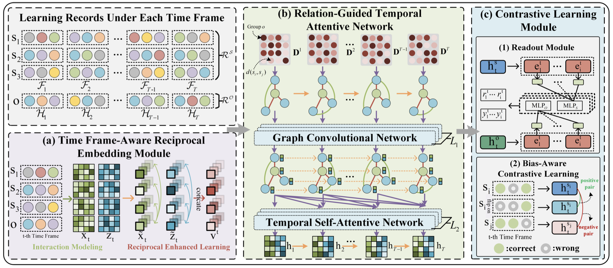
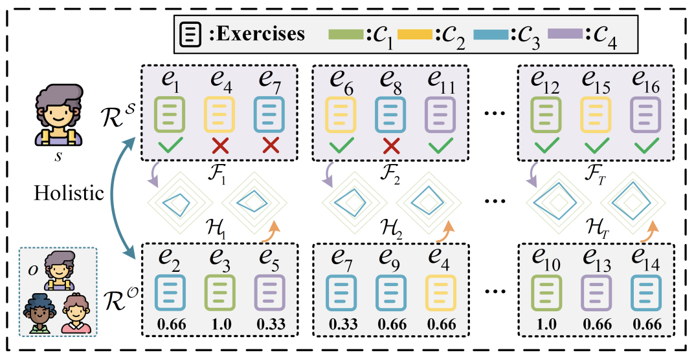

### RIGL: A Unified Reciprocal Approach for Tracing the Independent and Group Learning Processes



***

The code in this repository is the implementation of the proposed RIGL model accepted by KDD-24, and the used datasets are the public benchmarks including ASSIST12, NIPS-Edu, SLP-Math and SLp-Bio, which can refer to the detailed description in the appendices.


#### Introduction
In the realm of education, both independent learning and group learning are esteemed as the most classic paradigms. The former allows learners to self-direct their studies, while the latter is typically characterized by teacher-directed scenarios. Recent studies in the field of intelligent education have leveraged deep temporal models to trace the learning process, capturing the dynamics of students’ knowledge states, and have achieved remarkable performance. **However, existing approaches have primarily focused on modeling the independent learning process, with the group learning paradigm receiving less attention. Moreover, the reciprocal effect between the two learning processes, especially their combined potential to foster holistic student development, remains inadequately explored.** 

To this end, we first introduce a new task called **holistic knowledge tracing (HKT)**, which refers to tracing knowledge states at both the individual and group levels simultaneously, drawing from independent and group learning processes.

[//]: # (![RIGL Framework]&#40;./images/hkt_task.png=600x600&#41;)
<div align="center">
    
</div>

Furthermore, in this paper, we propose **RIGL**, a unified Reciprocal model to trace knowledge states at both the individual and group levels, drawing from the Independent and Group Learning processes. Specifically, we first introduce a time frame-aware reciprocal embedding module to concurrently model both student and group response interactions across various time frames. Subsequently, we employ reciprocal enhanced learning modeling to fully exploit the comprehensive and complementary information between the two behaviors. Furthermore, we design a relation-guided temporal attentive network, comprised of dynamic graph modeling coupled with a temporal self-attention mechanism. It is used to delve into the dynamic influence of individual and group interactions throughout the learning processes, which is crafted to explore the dynamic intricacies of both individual and group interactions during the learning sequences. Conclusively, we introduce a bias-aware contrastive learning module to bolster the stability of the model’s training. Extensive experiments on four real-world educational datasets clearly demonstrate the effectiveness of the proposed RIGL model.


#### Dependencies
* python 3.8
* pytorch 1.13+cu117
* torch_geometric
* numpy
* pandas
* sklearn
> * pip install torch_geometric 
> * pip install pyg_lib torch_scatter torch_sparse torch_cluster torch_spline_conv -f https://data.pyg.org/whl/torch-1.13.0+cu117.html


#### Usage
Train & Test model:
```
python3 train_rigl.py --dataset_name "nips_edu20" --seq_len 30 --learning_rate 1e-4 
```

#### References

* pykt: https://github.com/pykt-team/pykt-toolkit
* EduKTM: https://github.com/bigdata-ustc/EduKTM

#### BibTex
If you find this work and the code helpful to your research, please kindly consider citing our paper. Thanks!

```
@inproceedings{yu2024rigl,
  title={Rigl: A unified reciprocal approach for tracing the independent and group learning processes},
  author={Yu, Xiaoshan and Qin, Chuan and Shen, Dazhong and Yang, Shangshang and Ma, Haiping and Zhu, Hengshu and Zhang, Xingyi},
  booktitle={Proceedings of the 30th ACM SIGKDD Conference on Knowledge Discovery and Data Mining},
  pages={4047--4058},
  year={2024}
}
```
